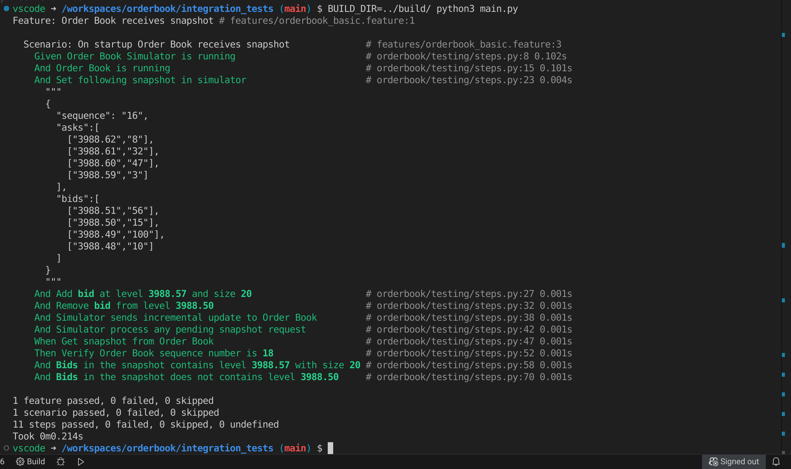
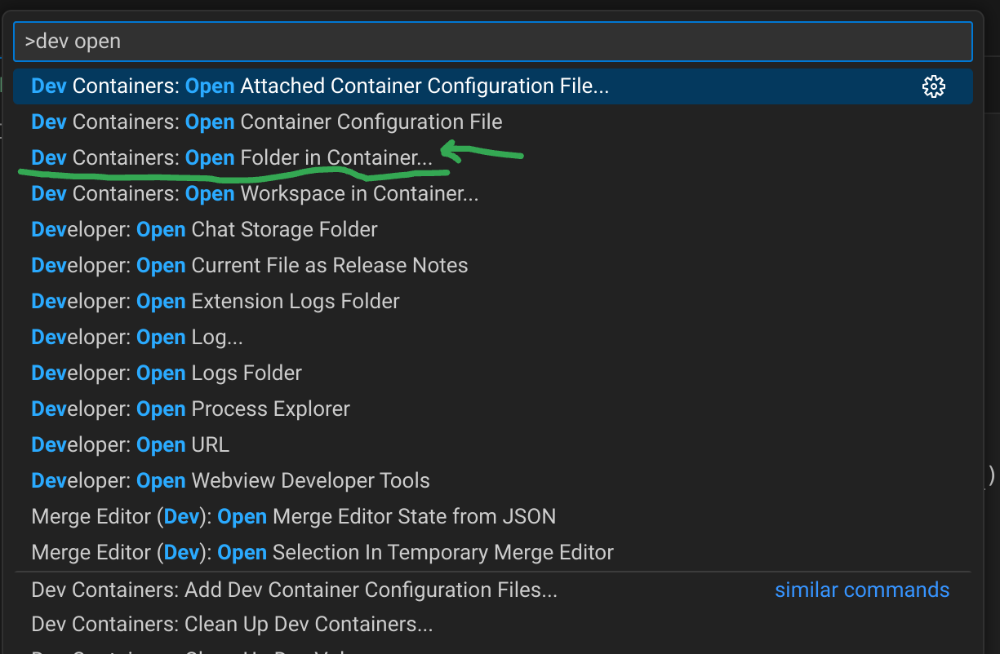

# Demo Url https://invaeg.com/orderbook/

# Design overview

---

# Integration Tests (Cucumber-style testing using python `behave`)

# How to run intergration tests
`docker compose run --rm intergration_tests`

# How to run build
`docker compose build`

# How to edit code in `vscode`
* Clone git repo
* Open repo in vscode
* Press `Ctrl + Shift + P` and then type `dev open` and choose `Dev Containers: Open Folder in Container...`
    * 
* VS Code will open in a docker container and code can be built or edited in-place
